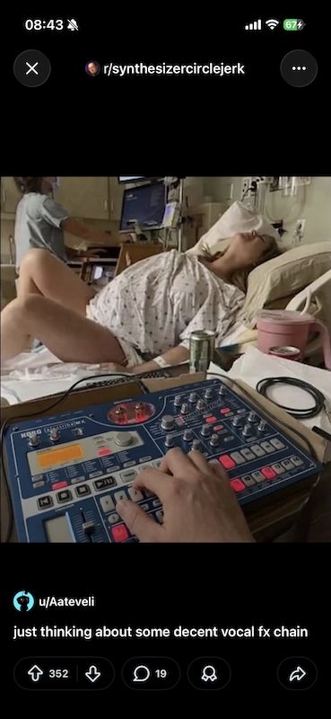
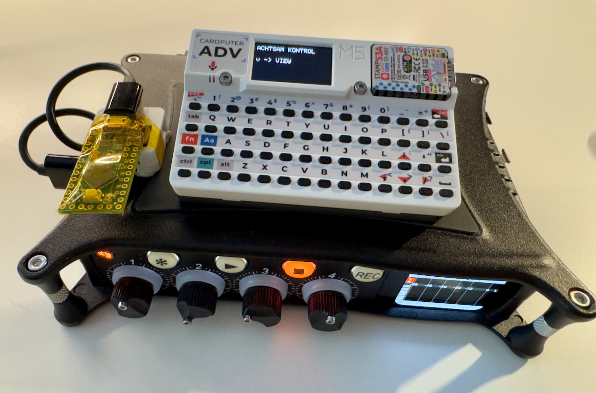

# ACHTSAM KONTROL

CARDPUTER -> ATOMS3 LITE -> TEESNY LC -> MIXPRE

## Features
- Wirerless Control a Mixpre 6
- Custom Keyinput Mapping
- ESP-NOW Transmission
- Keymapping Visualization
- Keyinput Audio Feedback
- Achtsam Ergonomisch Layout
- No need to press Modifier keys

## Hardware

- M5Cardputer ADV 
- ATOMS3 Lite via ESP-NOW
- Teensy LC as USB Keyboard

## Cardputer Key | Mixpre Function
| Key     | Function         | Key | Function      | Key  | Function  |
|---------|------------------|-----|---------------|------|-----------|
| `` ` `` | ESC              | `'` | ESC           | `BS` | BACKSPACE |
| `q`     | * SHORTCUT       | `\` | MENU          |
| `h`     | HOME             | `f` | FILE          | `v`  | VIEW      |
| `z`     | FRONT PANEL LOCK | `x` | FILE TRANSFER |

| Key | Function | Key | Function | Key     | Function |
|-----|----------|-----|----------|---------|----------|
| `j` | PLAY     | `k` | STOP     | `l`     | RECORD   |
|     |          | `m` | CUE MARK | `SPC` | PLAY     |

| Key | Key | Key | Key   | Function | Key | Function |
|-----|-----|-----|-------|----------|-----|----------|
| `w` | `e` | `r` | `,`   | LEFT     | `/` | RIGHT    |
| `a` | `s` | `d` | `;`   | UP       | `.` | DOWN     |
|     |     |     | `ENT` | OK       |

|Key|Function|Key|Function |Key|Function |
|---|--------|---|---------|---|---------|
|`1`|CH 1    |`7`|MUTE CH 1|`u`|SOLO CH 1|
|`2`|CH 2    |`8`|MUTE CH 2|`i`|SOLO CH 2|
|`3`|CH 3    |`9`|MUTE CH 3|`o`|SOLO CH 3|
|`4`|CH 4    |`0`|MUTE CH 4|`p`|SOLO CH 4|
|`5`|CH 5    |`-`|MUTE CH 5|`[`|SOLO CH 5|
|`6`|CH 6    |`=`|MUTE CH 6|`]`|SOLO CH 6|

## Demo Video

## Known Issue
- Currently requires USB-C power for device detection.
- After startup, USB-C power can be disconnected.

## ToDo
- Macro Key
- Achtsam Sound
- Drone Mode  
- Screensaver
- Battery Status
- Recording Status / Time
- Blackmagic Cam Record Button
- Control Voltage support
- LoRa message control support
